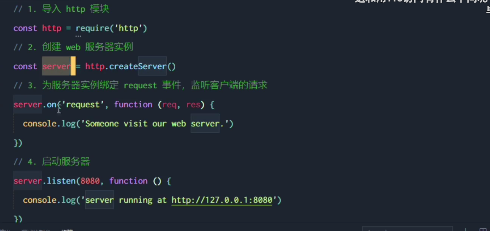

# Node.js

## Node.js


## js解析引擎


## 运行环境


# fs文件系统模块


fs模块相当于是标准库，node就是类似于Java中的jre环境，提供了很多标准库使用。


## fs.readFile()使用

- 第一个参数是文件路径，可以是相对的，也可以是绝对路径

- 第二个参数是文件读取的编码格式
- 第三个参数是回调函数

readFile返回的是一个Promist对象，有调用失败和调用成功的两个回调函数。Node的设计是错误先行，所以一般的回调函数的第一个回调参数都是error，第二个参数才是result


readFile返回一个promise对象

无论是读取文件还是写文件返回的都是一个Promise对象，会有一个回调函数，node的设计是错误先行，所以第一个参数是err，第二个参数是res

## fs.writeFile()使用

- 第一个参数是写出的文件路径
- 第二个参数是文件的内容
- 第三个参数是可选的，表示以什么样的编码格式写出，默认是utf8
- 第四个参数是回调函数，同样的回调函数的第一个参数是err，第二个参数是result，注意node的设计是回调先行的，所以回到函数的第一个参数基本上都是err，第二个参数才是result


write函数会自动将原有的文件覆盖，直接覆盖掉原有的文件。

### 案例


### 步骤


forEach()函数，和join函数拼接，方便数据的处理

## 路径拼接问题

这个问题不是说不能执行js文件，执行js文件可以使用的命令是：node + 文件的存放位置，只是说js文件在读取其他文件的时候会以node命令执行的目录拼接上定义的相对路径，这是路径拼接的问题。


在终端中，只要node的路径中，是相对路径，那么node就会以 当前的目录 + 代码中所给的路径作为最终的路径，所以即使写的node + 正确的路径，但是拼接的也是错误的路径。

#＃# 代码演示

```javascript
/**
 * 导入fs模块，运行
 */

const fs = require('fs');

/**
 * 给定一个回调函数，表示成功运行或者失败运行时的回调
 * node的设计是错误先行，所以第一个参数是错误的回调信息
 */
fs.readFile('./1.txt','utf8', function(err, res) {
    console.log(err)
    console.log(res)
})

fs.readFile('./2','utf8',(err,res) => {
    console.log(err)
    console.log(res)
})

```

控制台信息

```shell
D:\OneDrive - luckywords\CodeWork\学习笔记\Node.js.assets\fs文件系统>node fs-readFile函数使用.js
Hello World
null

D:\OneDrive - luckywords\CodeWork\学习笔记\Node.js.assets\fs文件系统>node fs-readFile函数使用.js
[Error: ENOENT: no such file or directory, open 'D:\OneDrive - luckywords\CodeWork\学习笔记\Node.js.assets\fs文件系统\2'] {
  errno: -4058,
  code: 'ENOENT',
  syscall: 'open',
  path: 'D:\\OneDrive - luckywords\\CodeWork\\学习笔记\\Node.js.assets\\fs文件系统\\2'
}
undefined
null
Hello World

D:\OneDrive - luckywords\CodeWork\学习笔记\Node.js.assets\fs文件系统>
```

###　路径错误问题

在控制台不同的路径执行相同的文件时，如果在原有的读取路径中写成的是相对位置，那么node会以控制台的路径拼接上相对路径，而不是文件的路径拼接上相对路径。

```javascript
/**
 * 演示不同路径下执行读取的错误，路径拼接错误
 */
fs.readFile('./1.txt','utf8',(err,res) => {
    console.log(err)
    console.log(res)
})
```


```shell
D:\OneDrive - luckywords\CodeWork\学习笔记\Node.js.assets\fs文件系统>node fs-readFile函数使用.js
null
Hello World

D:\OneDrive - luckywords\CodeWork\学习笔记\Node.js.assets\fs文件系统>cd ../..

D:\OneDrive - luckywords\CodeWork\学习笔记>node Node.js.assets/fs文件系统/fs-readFile函数使用.js
[Error: ENOENT: no such file or directory, open 'D:\OneDrive - luckywords\CodeWork\学习笔记\1.txt'] {
  errno: -4058,
  code: 'ENOENT',
  syscall: 'open',
  path: 'D:\\OneDrive - luckywords\\CodeWork\\学习笔记\\1.txt'
}
undefined

D:\OneDrive - luckywords\CodeWork\学习笔记>
```

## 解决方案


使用node给定的属性，__.dirname表示当前文件所处的路径。

# path路径模块

涉及到路径的拼接问题都需要用到path模块，不要直接使用+号进行操作，涉及到路径的问题一定使用path模块进行处理。加号不能处理一些特殊的错误。

- 例如不小心在拼接字符串时，多加上了一个点，path模块可以直接帮我们去掉，但是+号会原样的拼接字符串。


### 拼接任意多个字符


## 获取文件名

使用 `path.basename(path)` 或者是 第二个参数是拓展名


讲传递的路径的最后一部分返回，即返回文件名或者是文件夹名，如果是文件名，那么拓展名也可以获取。如果不想获取文件的拓展名，那么传入对应的拓展名，必须要知道对应的拓展名。

## 获取文件的拓展名

获取文件的拓展名`path.extname()`

```javascript
let val = path.join(__dirname,'1.txt')

fs.readFile(path.join(__dirname,'1.txt'),'utf8',(err,res) => {
    console.log(err);
    console.log(res);
})

console.log(path.basename(val));
console.log(path.basename(val,'txt'))
console.log(path.basename(val,path.extname(val)))
```

控制台输出

```shell
D:\OneDrive - luckywords\CodeWork\学习笔记>node Node.js.assets/fs文件系统/fs-readFile函数使用.js
1.txt
1.
1
null
Hello World

D:\OneDrive - luckywords\CodeWork\学习笔记>
```

## 案例

将一个完成的html文拆分成三个文件


# http模块


## IP地址与服务器


整个IP地址是很重要的内容，有时间还是有好好的补补TCP/IP的知识。


## 使用步骤

- 导入http模块
- 创建服务器实例
- 给服务器实例绑定事件，使用.on进行事件的监听，服务器实例返回回调函数，回调函数两个参数是req和res，是请求对象和响应对象。
- 启动服务器，参数有一个对调函数

注意：给服务器绑定事件的回调函数和启动服务器时的回调函数时不一样的。



### req请求对象


知识点复习

js的字符串拼接，用tab键上的反引号代替引号，是ES6中新增的语法，通过\$可以直接引用变量的值，称为模板字符串

### res响应对象

使用res.end方法，给客户端响应一些内容。中文乱码可设置响应头为utf8。res.writeHead(200,{'Content-Type':'text/html; charset=utf-8'})

或者是使用setHead方法


## 路由使用

根据不同的url，响应不同的内容

步骤


代码实现


## 案例 实现资源的返回


此时的服务器软件相当于资源的搬运工，将本地的资源读进内存中，然后将数据发送到客户端。资源就是和一个一个的url进行绑定的，所以URI和URL的表示很多时候就是指某一个资源的位置，统一资源定位符

客户端有关的信息都是在请求中携带过来的，获取客户端的信息（不是客户），一般都是在请求中获取，因为请求中就会带有客户端访问的信息。

# 模块化

默认使用的是commonJs规范，使用的是 require和module.export语法


## 模块分类


## 模块加载


注意加载自定义模块的使用是导入一个路径，而不是一个名称，当然也可以变为一个名称，知识需要安装。在默认路径下进行导报。

注意：再使用require方法对其他模块进行加载时，会自动执行其他模块内的方法。可以省略js的拓展名。

## 模块作用域

如果属性或者是定义的数据没有被导出，那么其他模块是不能访问整个模块内的属性的，类似于Java开发中的pojo，或者是一个bean，提供了private私有属性，但是提供了setget方法进行访问。


## module对象

每一个js模块都有一个module对象指向，存储了当前模块有关的信息。


包括当前的路径，文件名称，父子模块的关系等


一定要记住，使用require进行模块导入时，会自动执行模块内的函数，执行被导入模块内的函数。之所以能够导入模块内的对象，是因为module.export中定义了导出的对象。所以用来接收模块的对象默认时空的。


在commonjs语法中，许多都是module.开头的使用，是因为commonjs默认每一个js文件就是一个module，访问一个js文件就是访问一个module对象。所以很多时候都是module进行属性或者是方法的访问。

直接导出一个属性


或者是定义了一个私有变量后，进行导出


## 注意点


即类似于层叠行，后面的代码会将前面已有的属性覆盖。

有些写法只是指定了一个属性，所以不会发生覆盖的情况，但是当整个module.export指向新的对象时，原有的即使是单独的设置属性，那也会覆盖掉原有的单独设置的属性。

一定要注意：导入的结果，永远都是以module.export指向的对象为准。

## exports对象


## 注意


应该是nodejs底层没有对exports直接赋值作相应处理。

module.export和export有优先级的关系，export的优先级比较低


看是否指向新对象，也看是否是单独设置属性，但记住require中导入的一定是module.export对象

## 规范


# 包

### 包的语义化规范


### 包解释


## 包的安装使用


### 时间格式化


现在推荐用Day.js代替moment.js

现在推荐使用Day.js代替moment.js，因为moment.js的打包体积太大了。


## 目录


### 包管理


一定要将 node_module添加到 .gitigonre中，方便上传，并且别人再使用的时候直接下载 npm install 即可防止环境的不同导致各种意想不到的错误


### 包管理配置文件


### 卸载包


### 运行时和打包编译时


## 包的分类

项目包


全局包


### 全局包实例

使用全举报的好处是只要加载了包，那么在本机上任何地方都可以使用，但是项目包只能在项目中进行使用，对于全局包一般是常用的脚手架工具，或者是一些转换的工具类，没有版本依赖问题的就作为全局包，项目包是为了解决有些项目只能泡在固定的版本上，如果版本不一致就会引发各种问题，此时就必须要提供相同的运行环境。

i5ting_toc能够将md文档转换为html文件

## 规范的包


###包结构

****


开发目录


# 模块的加载机制

- 模块加载会被缓存


- 内置的模块包优先级最高


- 加载自定义的模块，必须要制定文件的路径，相对路径，否则会按照相对路径进行寻找


- 记载模块时，吐过省略了文件的拓展名，那么会按照以下的拓展名进行寻找


- 当给定的一个模块没有给定相对路径时，即先从当前的node_module进行寻找，如果没有找到，那么会往上一级进行查找，直至找到或者是找不到。


- 目录作为模块进行加载


# Express

## 简介

是一个基于Nodejs的快速开发web模块，能够提供快速的web开发项目实现


## 理解


开发的效率更高， 提供的服务更多。

### 功能

一个是直接作为web服务器进行服务，一个是API接口服务器，一般都是前后端项目的服务，即提供接口进行服务


一般固定某一个版本的express


express()是无参构造函数，创建一个express实例

### 使用

三个步骤创建express服务器


一般node中使用模块的步骤都是

- 导入模块
- 使用模块创建实例
- 使用实例，或者是启动实例

## 使用

和原生http模块不一样的是，express模块导入可以生成一个服务器，然后创建一个实例，最后绑定监听的端口即可

### 监听get请求

和原生的http模块类似，第一个参数是url


### 监听post请求

和get请求类似，第一个是url，第二个参数是回调函数，回调函数的参数是两个，和原生的http相似，第一个参数是请求对象，第二个参数是响应对象


### 响应客户端

类似于原生的node的http模块中的end方法，express提供的是send方法，将处理好的内容提供给客户端。


，express服务模块是前端开发中经常使用的简单服务器的框架，主要是创建服务实例或者是提供api接口简单，能够快速的搭建起一个服务实例，所以一定要掌握好基于nodejs的服务实例，express模块。

- app.get(url,function(req,res){})
- app.post(url,function(req,res){})
- app.send(val)

## 参数查询

### url中的参数查询

默认情况是：query是一个空对象，既没有参数，通过rea.query可以获得url中的参数


### url中的动态参数

动态参数简单来理解就是RESTful风格的url，但是url中的参数不确定


rea.params获取的，是给定的路由中，：冒号后面的id就是key，实际传递的值就是value，简单来说就是 冒号后面的就是params的key，是一个变化的key，实际传递的值就是一个value，只只有冒号是固定的写法，其余的都不是固定的写法。可以有多个参数的写法，即能够匹配动态参数。注意这个即使是url参数，但是和query参数不一样的。

## 静态资源管理

- 普通静态资源管理
- 多个静态资源存储管理
- 给定前缀的静态资源管理
- 多个给定静态资源管理

express提供的静态资源服务中的express.static()函数不是app.static()而是直接俄调用express.static()，就能够将某个文件夹作为静态资源文件夹了，此时需要注意的是：在访问时url中不会出现指定的静态资源文件夹，因为express是通过映射的形式制定了静态资源文件夹，类似于Django的static 


### 提供服务


通过app.use(rexpress.static(路径)) 即可完成静态资源的提供服务。在外层使用app.use()，绑定上当前的服务实例，然后对静态资源的目录进行指定，通过express.static()中指定的静态资源文件存储位置。

### 多个静态资源文件存储位置

express会根据托管的静态资源顺序查找，按照静态资源托管的顺序进行顺序的查找。查到了这个静态资源文件，那么就不会继续往下寻找，如果找不到就会报404的错误，只是寻找符合要求的第一个静态资源文件，按照静态资源托管的顺序进行查找。


### 挂载路径前缀

即url中要按照给定的前缀才能访问给定的静态资源文件，否则会找不到资源文件。


## nodemon

### 解释


### 使用


## Express路由

### 路由

路由是一种映射关系，能够将某一个东西与另外一个东西关联起来。

在服务过程中，路由就是客户端的请求和服务端处理函数的映射关系。


### 案例


### 路由匹配过程


```javascript
最简单的路由实现
app.get('/',(req,res) => {
  app.send("世界你好")
})
```

### 模块化路由


### 创建过程


理解js中的解构 

```javascript
import {xxx,xxx} from 'xxx.js' 这个就是一个解构，简单来说从js文件中拿到了两个对象，虽然看起来是挺正常的，但是这个就是一个解构

一个参数中是一个对象 context
context = {
  age: 18,
  name: lisi
}

如果需要解构对象，除了可以直接使用 ... 拓展运算符号外，还可以直接拿到独享中的属性
如 {age} 就是一个结构对象的过程，注意使用这个语法，必须是原context中的位置，{age}代替了context的参数位置，这样的解构才是有效果的。
```

### 使用路由对象


### 添加路由模块的前缀


即url需要特定的访问前缀才能正确的访问到响应的服务，否则404

## 阶段总结

### 基础部分

### Express部分

在node中，虽然可以有简单的http模块能够简单的进行服务通信，但是原生的api过于简单，服务过于单一，所以出现了express这个框架，能够帮助我们快速的搭建一个简单的响应接口或者是web服务。

- 导入express
- 调用express()函数，返回一个服务实例app（任意名）
- 此时的app就是一个服务实例了，能够进行服务的通信了
- 启动express服务实例，使用app.method，就能够完成对应的请求方式的处理，启动express的服务使用的是app.listten(端口号，启动的回调函数)
- 这些函数都有两个参数，第一个参数是url，第二个参数是一个回调函数，回调函数有两个参数，第一个参数是请求对象req，第二个参数是响应对象res，
- express框架使用app.send方法，将处理好的内容返回客户端
- express调用req的属性，能够将url或者reqbody中的参数拿到，默认情况下这些都是一个空的对象。
- express.static()能够将某一个存储位置变为一个静态资源管理位置，即能够放行其中的内容不需要经过监听拦截等。静态资源管理由普通的静态资源管理，多个普通静态资源管理，给定前缀静态资源管理，多个给定前缀静态资源管理等等。注意：使用express.static()函数必须是express.static()作为一个参数传入 app.ues() 中，表示当前的服务实例绑定了这个静态资源管理，如果只有一个参数是express.static()，那么表示不给顶前缀，如果第一个参数是一个字符串，表示当前的静态资源文件管理的访问中，url必须要带有给定的前缀才能够访问，否则不允许通过，或者是响应404

## Express中间件

### 简介

中间件简单来说是为了提升开发效率，将一些复用的流程抽离出来，然后按照网络的请求处理过程进行调用。


### 格式

如何区分一个路由函数和中间件函数，中间件中next函数是必选的参数。路由函数中只有只有req和res


### 定义中间件函数


一定要调用next函数，next（）相当于通行证，如果没有调用next函数，那么这次的网络请求就会停留在这个中间件中，无法继续做出相应。

请求的对象一般是先进入中间件处理，最后才是路由函数的处理，简单来说中间件就是处理数据的流程，调用next函数进行多次的数据处理，最后调用了路由函数。一定要记住没有next函数，就会被一直拦截，无法响应

#### 全局中间件


#### 简化中间件的写法


### 中间件的作用

对于一个请求响应对象来说来说，多个中间件是共享这次的这次的请求响应对象的，所以可以在上游的中间件中添加相应的属性供下游的中间件使用。简单说就是不同的路由中相同的处理流程抽离出来降低复杂度，冗余度


### 定义多个全局中间件

会按照定义的顺序进行顺序的执行所有的全局中间件，最后返回到路由函数中，进行响应。#


### 局部中间件

在路由函数中，第二个参数的位置写上自定义的中间件名称，即可仅对当前路由生效，不影响其他的路由。


### 使用多个局部中间件


在第二个参数的位置上，调用多个中间叫你函数即可，或者是多个中间件作为数组传入第二个参数，会按照给定的顺序进行处理。会按照给定的参数的位置或者是数组中的位置进行处理。

### 注意事项

由于js是顺序执行，从上到下执行的流程，所以定义中间件要在路由函数之前，或者是导入中间件函数，要在路由函数之前。一定要next函数，多个中间件是共享一次的请求对象和响应对象的。


### 中间件分类


- 应用级中间件- 绑定到了app上


- 路由级别的中间件- 绑定到路由上


- 错误级别的中间件函数- 捕获异常的中间件函数


捕获异常的中间件函数一般写在路由的后面，只要发生了错了就会调用错误级别的中间件函数，错误级别的中间件函数有四个参数，第一个参数 就是err对象，其余参数和其他的中间件参数一致，同时也是共享一次请求响应对象的。

错误中间件必须写在左右中间件以及路由的后满。是按照js执行流程来决定的，其他的全局局部中间件需要在路由函数之前起作用所以写在路由函数之前，而错误级别的中间件是捕获全局的异常，所以写在所有路由函数之后，才能捕获所有的错误。

- Express内置的中间件

最常使用的三个中间件就是静态资源的管理（回顾static的写法）

```js
app.use(express.static('静态资源目录地址'))

或者是

app.use('前缀别名',express.static('静态资源目录地址'))
```


- 第三方的中间件


### 自定义中间件


### 监听data事件


### 监听end事件

可以学习TCP/IP中怎么结束一个传输过程，传送的信息是什么，每一门语言都提供了响应的处理函数。


## 跨域问题


### express解决跨域问题

使用一个中间件允许客户端进行跨域。跨域的解决有纯前端跨域和后端解决两种方案，跨域是相对于客户端访问服务端时的流程来说的，对于一个服务端来说，如果检测到了客户端访问时，浏览器会自动进行跨域的拦截，如果检测到了协议ip或者是端口号有一个不同，那么就会引发跨域问题，这是仅限于客户端访问服务端才会出现，如果是服务器请求另外一个服务不会出现跨域问题。这个是浏览器自带的安全策略。

- 前端使用的就是模拟一个服务器发送请求，对真实的请求进行代理，让模拟的服务器发送请求后将数据转给本地的数据渲染框架。
- 后端的解决方案很简单，允许客户端跨域即可


### 解决方案

第一个


第二个


第三个


## 请求

OPTIONS就是预检请求，检查请求方式的种类有什么，进行校验，然后判断能否发送正式请求

普通请求


预检请求


### JSONP

JSONP相当于后台生成一段JS代码插入到前端JS页面中，来执行前端已经定义好的回调函数

后面因为使用JQ封装的JSONP，用起来和GET/POST一样，但是其实里面根本不一样


## 数据库


### 安装


### 配置模块

- 导入模块
- 创建数据库服务实例，进行配置


### 使用

- 查询语句

- 使用数据库服务实例调用query函数即可，

直接使用db.query进行查询即可，有一个回调函数，第一个蚕食SQL语句

第一个参数是查询语句，第二个参数是回调函数，回调函数传入两个参数，第一个是err，第二个是res，记住node的设计是错误先行。和Java等不一样的还需要配置bean，pojo等进行映射关系的实体类等，js中直接可以生成对象，并且数据类型并不是固定的，所以在进行数据的操作时，很容易的就实现了数据的封装。这个也是弱类型语言的优势，适合作为一个orm框架的语言就是动态类型的语言。

`select 1` 表示连接是否成功，不返回任何数据。


- 插入数据

插入数据和查询数据类似，只是带有了插入的对象，第一个参数还是sql语句，只是sql语句中，可以使用`？`进行占位 。使用？进行展位，这样能够动态的防御注入风险。


简化写法

使用关键字和？进行数据的整体插入，便捷的插入。


- 更新数据


简化写法和插入数据一样，都是使用关键字和？进行简化数据，只需要数据传递的正确，那么就可以使用。如果直接写成一个？，那么模块会自动将传入的参数进行解构。

- 删除数据


标记删除


js的模块会自动将数据进行解构。


# Web开发模式


## 服务端的渲染

常用中间件

- mysql  提供数据库服务 @2.18.10
- bcryptjs 提供密码加密服务 @2.4.3
- express.json()  提供了解析post方法的json类型的body，通过 express.json() 这个中间件，解析表单中的 JSON 格式的数据
- express.urlencoded() 提供了解析post方法的普通body xml/application类型，通过 express.urlencoded() 这个中间件，来解析表单中的 url-encoded 格式的数据
- jsonwebtoken 提供了jwt的生成服务，记得定义密钥
- express-jwt 提供了解密token的服务，记得得到密钥
- multer 提供了处理form data 请求体的功能。


### 优势和劣势


## 前后端分离模式

依赖于Ajax的发展


### 优势和劣势


对于企业来说最重要的是如何优化SEO，可以选择SSR技术，进行SEO优化。

## 如何选择开发模式


简而言之：如果不关注SEO优化并且交互效果很多，如后台登陆系统等，那么直接前后端分离比较好，如果关注SEO优化，如各种网站的首页等，那么使用服务端渲染比较好。 

## 前后端的身份认证


### 原因


### 认证技术


现在前后端分离中的主要认证方式就是通过JWT技术进行认证。

## HTTP协议的无状态性

 HTTP对于每一次的连接，任何两个连接之间都是没有直接的关系的


所以需要证明需要的两个请求之间有关联，那么就需要使用到认证技术，也就是每次通过这些凭证来证明这两个连接之间是有关系的。

### Session认证


每当访问对应的网站时，浏览器会自动的自动发送对应的域名下的cookie，是域名独立的，不同的域名之间不会相互影响，在访问相应的网站时，会自动的，一次性的将所有的未过期的cookie发送到对应的网站上。

### 不具有安全性


安全，隐私，敏感的数据一般不放在本地的浏览上


解决方案  提高认证额安全性


### 认证的原理


在服务中存储登录的状态，而不是通过客户端记录状态，这样的控制权就掌握在服务器受伤，而不是客户端的手上。这样客户端无法伪造数据，提高了数据验证的安全性。


## JWT认证原理


- 在客户端将用户的数据发送给服务端
- 服务端根据用户的数据生成一个token
- 用户的本地数据中存储这个token
- 每次发送请求就会带上这个token，Authorizations的字段中。

### 组成


组成部分的功能，header和signature都是为了保证payload的安全性，payload是真正存放用户数据的地方。


### 使用


### 定义密钥


### 生成token


## 验证

详细使用文档 ： npmjs.org 中进行搜索即可


参数中可以添加中间件，即中间件的调用过程中，还可以要求必须要另外i一个中间件完成了验证返回才允许执行


使用express的流程：

- 首先明确路由模块，每一个不同的服务对象都是一个不同的模块，需要拆分
- 定义路由函数，将路由函数和路由进行拆分
- 定义验证规则，将逻辑处理和验证规则进行拆分，方便以后的维护
- 最后返回信息